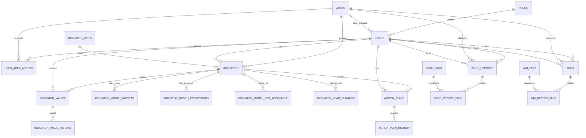
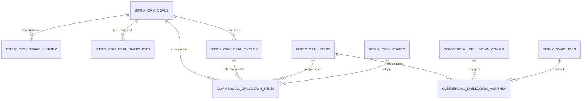
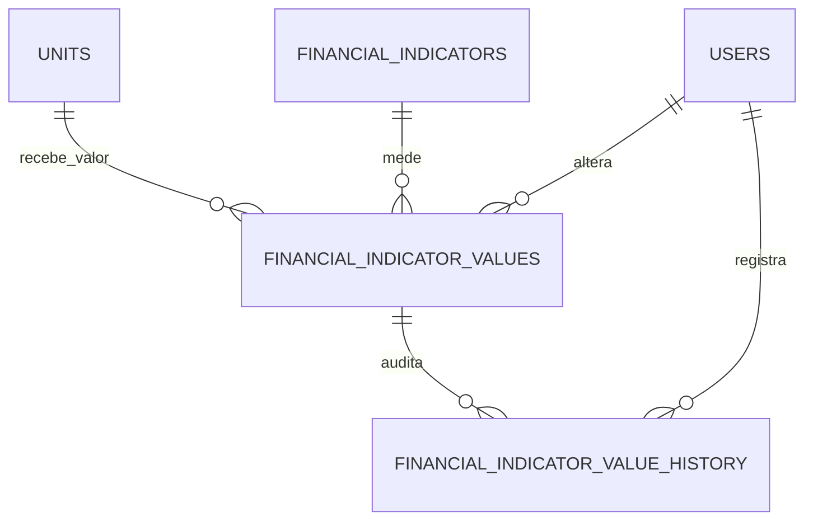

# Modelo de Dados: PSC

Data: 2026-07-31
Escopo: Supabase/Postgres, modelos Python, modelos TypeScript, dados materializados do Drill Down Comercial e base do Drill Down Financeiro.

## Visao Geral

O PSC usa Supabase/Postgres como persistencia principal. Existem duas camadas de dominio no repositorio:

- Python em `src/core/domain/`, usado pela aplicacao executavel local e pelo admin local.
- TypeScript em `psc-web/src/core/domain/`, usado pelo fork web Next.js.

O schema consolidado `sql/000_consolidated_schema.sql` declara consolidar migrations `001..023`. As migrations `024..031` adicionam identidade Bitrix, admin web, Wins, planejamento anual, Drill Down Comercial, permissoes granulares de Drill Down, base Financeira, espelhamento dos indicadores da area financeira e Drill Down Marketing; portanto bancos novos precisam aplicar o consolidado e depois os incrementais ainda nao incorporados.

## Diagrama ER Principal

## Diagrama ER Comercial

## Diagrama ER Financeiro

## Modelo Marketing Bitrix

- `marketing_drilldown_config`: metadados de area, categorias, metricas e regras de canal.
- `bitrix_marketing_deals`: cards minimos dos CRMs 95 e 125, com canal normalizado.
- `bitrix_marketing_stage_history`: historico de entrada em etapas para detectar cards que chegaram em Won.
- `marketing_drilldown_monthly`: agregados por ano, mes, metrica e canal.
- `marketing_drilldown_items`: cards que compoem cada celula do Drill Down Marketing.
- Fonte: Edge Function `supabase/functions/marketing-sync/index.ts`.
- Observacao: Marketing nao usa CRM 0; CRM 95 usa Fonte e tags de titulo para canais, e CRM 125 entra como `OUTBOUND`.

## Entidades e Registros

### Role

- Tabela: `roles`
- Modelos: literal `Role` em Python e TypeScript.
- Codigos observados:
  - `gestor_area`
  - `gestor_tatico`
  - `gestor_operacional`
  - `executivo`
  - `executivo_visualizacao`
- Funcao: base de autorizacao.

### User

- Tabela: `users`
- Modelos: `User` em Python/TypeScript.
- Campos principais: `email`, `password_hash`, `name`, `role`, `area_id`, `is_active`.
- Flags: `can_edit_projected_value`, `can_edit_indicator_maturity`, `can_use_issue_reports`, `can_admin_users`, `can_view_commercial_drilldown`, `can_view_marketing_drilldown`, `can_view_financial_drilldown`, `can_edit_financial_drilldown`.
- Identidade Bitrix: `bitrix_user_id`, `bitrix_portal_domain`, `last_login_at`.
- Relacionamentos:
  - `role` referencia `roles.code`.
  - `area_id` referencia `areas.id`.
  - multiplas areas via `user_area_access`.
- Ciclo de vida:
  - Admin local cria/edita/desativa com senha.
  - Admin web provisiona ou atualiza a partir de usuario Bitrix existente.
  - Usuario inativo nao opera.
  - Edicao financeira implica visualizacao financeira.

### Area

- Tabela: `areas`
- Modelo: `Area`.
- Campos: `name`, `hex_color`, `is_active`.
- Ciclo de vida: criacao/edicao por executivo ou admin autorizado; desativacao logica.

### IndicatorUnit

- Tabela: `indicator_units`
- Modelo: `IndicatorUnit`.
- Funcao: normalizar unidade exibida nos indicadores.

### Indicator

- Tabela: `indicators`
- Modelos: `Indicator`, `NewIndicator`, `IndicatorTableRow`.
- Campos: `area_id`, `name`, `description`, `aggregation_type`, `unit_id`, `unit`, `maturity_level`, `is_active`, `created_by`.
- Regras:
  - `aggregation_type` em `sum`, `avg`, `latest`.
  - `maturity_level` entre 0 e 100 quando informado.
  - nome ativo nao deve duplicar outro indicador ativo.
- Dados derivados no dashboard:
  - valor mensal real.
  - meta mensal.
  - projecao mensal.
  - meta anual.
  - real anual.
  - projetado anual.
  - percentual de atingimento projetado.
  - classificacoes de maturidade, confianca e atingimento.

### IndicatorValue e Historico

- Tabela: `indicator_values`.
- Chave funcional: `indicator_id + year + month + week_number`.
- Faixas mensais: 1-7, 8-14, 15-21, 22-ultimo dia.
- Historico: `indicator_value_history` registra mudancas de valor existente na implementacao Python.

### Planejamento Mensal e Anual

- `indicator_month_targets`: meta mensal por indicador/ano/mes.
- `indicator_month_projections`: valor projetado mensal.
- `indicator_month_not_applicable`: marca mes como N/A.
- `indicator_year_planning`: meta anual e `confidence_level` por indicador/ano.

Regras:

- meta mensal nao pode ser negativa.
- projecao mensal pode ser negativa, mas exige permissao.
- `confidence_level` deve estar entre 0 e 100.
- meses futuros do ano atual sao tratados de forma diferente no dashboard comercial; indicadores usam ano selecionado.

### ActionPlan

- Tabelas: `action_plans`, `action_plan_history`.
- Modelos: `ActionPlan`, `NewActionPlan`, `ActionPlanHistoryEvent`.
- Campos principais: indicador, titulo, ocorrencia, causa, proposta, responsavel Bitrix, prazo, task Bitrix, status e criador.
- Ciclo de vida:
  - criado por executivo/admin autorizado.
  - pode criar tarefa no Bitrix24.
  - historico registra eventos.

### IssueReport

- Tabelas: `issue_reports`, `issue_tags`, `issue_report_tags`.
- Modelo: `IssueReport`.
- Campos de solicitante: `requester_id`, GUT solicitante e score gerado.
- Campos executivos: GUT executivo, score gerado, `reviewed_by`, `reviewed_at`.
- Campos narrativos: `ocorrencia`, `identificacao_causa`, `proposta_solucao`.
- Ciclo de vida:
  - criado por executivo ou usuario com `can_use_issue_reports`.
  - listagem nao executiva pode ser limitada ao solicitante.
  - executivo revisa status/GUT/tags.
  - delete e logico com `is_deleted`.

### Win

- Tabelas: `wins`, `win_tags`, `win_report_tags`.
- Modelo: `WinReport`.
- Estrutura semelhante a `IssueReport`, mas criacao web simplificada.
- Migration `027` define defaults para GUT e campos narrativos legados, permitindo clientes que nao peçam G/U/T ao usuario.
- Ciclo de vida:
  - criado por usuarios com acesso a issues/wins.
  - revisao executiva e tags seguem padrao parecido com Issue Reports.
  - delete logico.

## Modelo Comercial Bitrix

### `commercial_drilldown_config`

- Chaves JSONB para timezone, categoria Bitrix, template de URL, metricas e grupos de stages.
- Metricas observadas:
  - `initial_meetings`
  - `presented_proposals`
  - `initial_pipe`
  - `semi_qualified_pipeline`
  - `qualified_pipe`
  - `closed_contracts`
  - `total_cards`

### `bitrix_crm_deals`

- Registro atual de deals/cards CRM do Bitrix.
- Chave primaria: `bitrix_deal_id`.
- Campos incluem stage, semantic, responsavel, valor, moeda, datas e flags.

### `bitrix_crm_users`

- Usuarios Bitrix sincronizados para nome e status de responsavel.
- Chave primaria: `bitrix_user_id`.

### `bitrix_crm_stages`

- Stages do funil Bitrix.
- Chave: `stage_id + category_id`.
- Usado para labels e agrupamentos de metricas.

### `bitrix_crm_stage_history`

- Historico de movimentacoes por deal.
- Usado para metricas de fluxo e reconstrucao de ciclos.

### `bitrix_crm_deal_snapshots`

- Captura diaria do estado corrente dos deals.
- Chave: `snapshot_date + bitrix_deal_id`.

### `bitrix_crm_deal_cycles`

- Ciclos de vida/reactivacao de deals.
- Unique por `bitrix_deal_id + cycle_number`.

### `commercial_drilldown_monthly`

- Celulas materializadas por ano, mes, metrica e responsavel.
- Guarda `quantity_value` ou `monetary_value`.
- Unique por `reference_year`, `reference_month`, `metric_key` e responsavel normalizado.

### `commercial_drilldown_items`

- Detalhes que compoem uma celula do dashboard.
- Permite drilldown paginado por metrica/mes/responsavel/busca.

### `bitrix_sync_jobs`

- Controle de jobs de sincronizacao.
- Estados: `pending`, `running`, `completed`, `failed`, `cancelled`.
- Indice unico impede mais de um job ativo (`pending/running`).
- A Edge Function atualiza `current_step`, `processed_records`, `total_records`, `cursor`, `error_message` e timestamps.

### `units`

- Tabela financeira de unidades operacionais.
- Campos principais: `name`, `bitrix_spa_item_id`, `bitrix_entity_type_id`, `bitrix_category_id`, `is_active`, `last_synced_at`.
- Funcao: representar unidades financeiras que recebem valores mensais.
- Fonte atual planejada: SPA Bitrix `entityTypeId=1070`, `categoryId=0`, sincronizado por `supabase/functions/financial-units-sync/index.ts`.

### `financial_indicators`

- Catalogo de indicadores financeiros.
- Campos principais: `name`, `description`, `value_type`, `aggregation_type`, `display_order`, `is_active`.
- `value_type`: `integer`, `decimal`, `percentage`, `money`.
- `aggregation_type`: `sum`, `avg`, `ratio`, `latest`, `formula`.
- Fonte inicial: espelho dos registros de `indicators` com `area_id = d9dbda82-eb4c-42d7-adce-92499715cd18`, preservando o mesmo UUID.

### `financial_indicator_values`

- Valor mensal por indicador financeiro e unidade.
- Chave funcional: `financial_indicator_id + unit_id + reference_month`.
- `value` pode ser nulo para vazio; zero e valor valido.
- Criacao/edicao passam por permissao de Drill Down Financeiro.

### `financial_indicator_value_history`

- Auditoria automatica de valores financeiros.
- Registra operacao, valor anterior, valor novo, usuario de alteracao e timestamp.
- Criada por trigger no banco para evitar auditoria apenas em UI.

## Contratos de API

### Python FastAPI

Rotas principais em `src/adapters/input/api_routes.py`:

- `POST /api/login`
- `GET /api/me`
- `GET/POST /api/indicators`
- `PUT/DELETE /api/indicators/{indicator_id}`
- `GET/POST /api/indicators/{indicator_id}/weekly-values`
- `POST /api/indicators/{indicator_id}/monthly-target`
- `POST /api/indicators/{indicator_id}/monthly-projection`
- `POST /api/indicators/{indicator_id}/monthly-na`
- `GET/POST /api/action-plans`
- `GET/POST /api/areas`
- `GET /api/bitrix-users`
- Issue Reports e tags
- `POST /api/system/shutdown`

### Next.js App Router

Rotas observadas em `psc-web/src/app/api/`:

- Auth: `/api/auth/bitrix/start`, `/api/auth/bitrix/callback`, `/api/logout`, `/api/me`.
- Indicadores: `/api/indicators`, `/api/indicators/[indicatorId]`, weekly values, maturity, monthly target/projection/N/A, annual planning.
- Areas e unidades: `/api/areas`, `/api/areas/[areaId]`, `/api/indicator-units`.
- Admin web: `/api/admin/users`, `/api/admin/users/[userId]`.
- Planos: `/api/action-plans`.
- Bitrix users: `/api/bitrix-users`.
- Issue Reports: `/api/issue-reports`, review, tags, delete.
- Wins: `/api/wins`, review, tags, delete.
- Drill Down Comercial: `/api/commercial-drilldown`, `/items`, `/sync`, `/sync-status`.
- Drill Down Financeiro: `/api/financial-drilldown`, `/api/financial-drilldown/values`.
- Drill Down Marketing: `/api/marketing-drilldown`, `/api/marketing-drilldown/items`, `/api/marketing-drilldown/sync`.
- Health: `/api/health`.

## Estados e Ciclos de Vida

- Sessao Python: bearer token em local storage, stateless, HMAC.
- Sessao Next.js: cookie `psc_session`, HTTP-only, JWT HS256, 12h.
- Areas/tags: desativacao logica.
- Issues/Wins: soft delete.
- Indicadores: delete observado remove dependencias antes de excluir.
- Jobs comerciais: `pending` -> `running` -> `completed` ou `failed`; jobs parados podem expirar por timeout configuravel na Edge Function.
- Dados comerciais: Edge Function apaga e reconstrui agregados/itens por ano processado.

## Evidencias

- Dominio Python: `src/core/domain/models.py`, `src/core/domain/rules.py`
- Dominio TypeScript: `psc-web/src/core/domain/models.ts`, `psc-web/src/core/domain/rules.ts`
- Persistencia Python: `src/adapters/output/supabase_repositories.py`
- Persistencia TypeScript: `psc-web/src/adapters/output/supabase-repositories.ts`
- Admin local: `src/admin/users_app.py`
- Admin web: `psc-web/src/components/AdminClient.tsx`, `psc-web/src/app/api/admin/users/route.ts`
- Auth web: `psc-web/src/infra/session.ts`, `psc-web/src/app/api/auth/bitrix/`
- SQL: `sql/000_consolidated_schema.sql`, `sql/024_add_bitrix_identity_to_users.sql`, `sql/025_add_user_admin_permission.sql`, `sql/026_wins_and_indicator_maturity_permission.sql`, `sql/027_roles_annual_confidence_and_simple_wins.sql`, `sql/028_commercial_drilldown_bitrix.sql`, `sql/029_drilldown_permissions_bitrix_domain_and_financial.sql`, `sql/030_sync_financial_indicators_from_indicators.sql`, `sql/031_marketing_drilldown_bitrix.sql`
- Edge Functions: `supabase/functions/commercial-sync/index.ts`, `supabase/functions/financial-units-sync/index.ts`, `supabase/functions/marketing-sync/index.ts`
