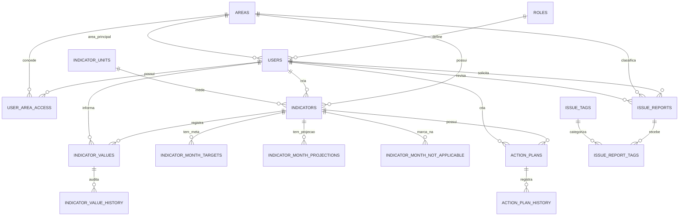

# Modelo de Dados: PSC Executavel

Data: 2026-07-11
Escopo: aplicacao executavel PSC e modulo executavel de administracao de usuarios. `psc-web/` esta fora do escopo.

## Visao Geral

O PSC usa Supabase/Postgres como persistencia principal. O dominio em Python representa os dados por dataclasses em `src/core/domain/models.py`; os adapters em `src/adapters/output/supabase_repositories.py` traduzem linhas Supabase para modelos de dominio.

`sql/000_consolidated_schema.sql` e o schema consolidado para bancos novos conforme documentado ate migrations `001..023`. As migrations `024` e `025` adicionam campos de identidade Bitrix e permissao administrativa de usuario.

## Diagrama ER

## Entidades Principais

### Role

- Tabela: `roles`
- Modelo: literal `Role` em `models.py`
- Codigos observados: `gestor_area`, `executivo`, `executivo_visualizacao`
- Funcao: base para autorizacao.

### User

- Tabela: `users`
- Modelo: `User`
- Campos principais: `email`, `password_hash`, `name`, `role`, `area_id`, `is_active`, `can_edit_projected_value`, `can_use_issue_reports`
- Campos adicionados por migrations recentes: `bitrix_user_id`, `bitrix_portal_domain`, `last_login_at`, `can_admin_users`
- Relacionamentos:
  - `role` referencia `roles.code`
  - `area_id` referencia opcionalmente `areas.id`
  - multiplas areas via `user_area_access`
- Ciclo de vida:
  - Criado, editado e desativado pelo executavel admin.
  - Autenticacao exige hash valido e usuario ativo.

### Area

- Tabela: `areas`
- Modelo: `Area`
- Campos: `name`, `hex_color`, `is_active`
- Ciclo de vida:
  - Executivo cria, edita e desativa.
  - Desativacao usa `is_active`, nao remocao fisica.

### IndicatorUnit

- Tabela: `indicator_units`
- Modelo: `IndicatorUnit`
- Funcao: normalizar unidade de medida exibida no indicador.

### Indicator

- Tabela: `indicators`
- Modelos: `Indicator`, `NewIndicator`, `IndicatorTableRow`
- Campos: `area_id`, `name`, `description`, `aggregation_type`, `unit_id`, `unit`, `maturity_level`, `is_active`, `created_by`
- Regras:
  - `aggregation_type` deve ser `sum`, `avg` ou `latest`
  - `maturity_level` deve estar entre 0 e 100 quando informado
- Ciclo de vida:
  - Executivo cria e edita.
  - Delete observado remove dependencias como planos, historico, valores, metas, projecoes e marcacoes antes de excluir indicador.

### IndicatorValue

- Tabela: `indicator_values`
- Modelo: `IndicatorValue`
- Campos: `indicator_id`, `year`, `month`, `week_number`, `value`, `source_user_id`
- Unicidade: `indicator_id + year + month + week_number`
- Ciclo de vida:
  - Gestor atualiza para indicadores das suas areas.
  - Alteracao de valor existente gera `indicator_value_history`.

### IndicatorValueHistory

- Tabela: `indicator_value_history`
- Funcao: auditar alteracoes de valores semanais.
- Criacao: ocorre quando um upsert altera valor existente para valor diferente.

### Planejamento Mensal

- `indicator_month_targets`: metas mensais definidas por executivo; nao podem ser negativas.
- `indicator_month_projections`: projecoes mensais definidas por usuarios com permissao; podem ser negativas.
- `indicator_month_not_applicable`: marca que o mes de um indicador nao se aplica; oculta valor real mensal sem apagar meta/projecao.

### ActionPlan

- Tabelas: `action_plans`, `action_plan_history`
- Modelos: `ActionPlan`, `NewActionPlan`, `ActionPlanHistoryEvent`
- Campos: `indicator_id`, `title`, `ocorrencia`, `identificacao_causa`, `proposta_solucao`, `bitrix_responsible_id`, `responsible_name`, `responsible_email`, `due_date`, `bitrix_task_id`, `status`, `created_by`
- Ciclo de vida:
  - Executivo cria.
  - Gateway pode criar tarefa Bitrix e salvar ID retornado.
  - Historico registra eventos do plano.

### IssueReport

- Tabelas: `issue_reports`, `issue_tags`, `issue_report_tags`
- Modelos: `IssueReport`, `NewIssueReport`, `IssueTag`
- Grupos de campos:
  - Solicitante: `requester_id`, `requester_gravity`, `requester_urgency`, `requester_tendency`, `requester_priority_score`
  - Revisao executiva: `executive_gravity`, `executive_urgency`, `executive_tendency`, `executive_priority_score`, `reviewed_by`, `reviewed_at`
  - Classificacao: `area_id`, `is_other_area`, `status`, tags
  - Narrativa: `ocorrencia`, `identificacao_causa`, `proposta_solucao`
- Ciclo de vida:
  - Criado por executivo ou usuario com `can_use_issue_reports`.
  - Listagem nao executiva e limitada ao solicitante.
  - Executivo revisa, altera status/GUT, gerencia tags e faz soft delete.

## Modelos de Entrada/API

Payloads da API principal em `src/adapters/input/api_routes.py`:

- `LoginRequest`
- `WeeklyValuePayload`
- `ActionPlanPayload`
- `CreateIndicatorPayload`
- `UpdateIndicatorPayload`
- `AreaPayload`
- `MonthlyTargetPayload`
- `MonthlyProjectionPayload`
- `MonthlyNotApplicablePayload`
- `CreateIssueReportPayload`
- `IssueExecutiveReviewPayload`
- `IssueTagPayload`
- `IssueTagsPayload`

Payloads do admin em `src/admin/users_app.py`:

- `AdminLoginPayload`
- `AdminUserPayload`

## Estados e Ciclos de Vida

- Token de auth e stateless: contem sujeito e expiracao assinados por HMAC.
- Sessao de UI fica em `localStorage` como `psc_token` ou `psc_users_admin_token`.
- Issue Reports usam soft delete com `is_deleted`, `deleted_at` e `deleted_by`.
- Areas e tags sao desativadas por `is_active`.
- Indicadores sao excluidos fisicamente apos limpeza manual de dependencias.
- `can_admin_users` existe no schema incremental, mas nao foi observado como autorizador no app admin atual.

## Evidencias

- Dominio: `src/core/domain/models.py`
- Regras: `src/core/domain/rules.py`
- Persistencia: `src/adapters/output/supabase_repositories.py`
- Admin: `src/admin/users_app.py`
- SQL: `sql/000_consolidated_schema.sql`, `sql/022_issue_fields_na_and_viewer_role.sql`, `sql/023_issue_report_tags.sql`, `sql/024_add_bitrix_identity_to_users.sql`, `sql/025_add_user_admin_permission.sql`
