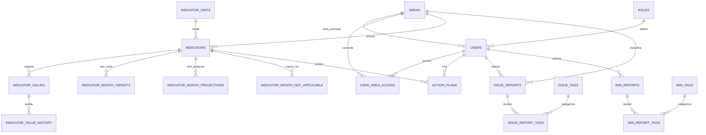
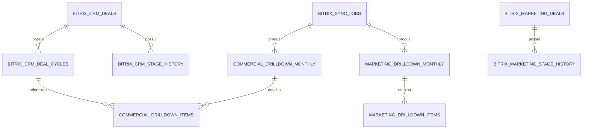

# Modelo De Dados: PSC

Data: 2026-08-04

## Visao Geral

O PSC usa Supabase/Postgres como armazenamento central. O dominio existe em duas implementacoes:

- Python: `src/core/domain/models.py` e repositorios em `src/adapters/output/supabase_repositories.py`.
- TypeScript: `psc-web/src/core/domain/models.ts`, regras em `rules.ts` e repositorios em `psc-web/src/adapters/output/supabase-repositories.ts`.

As migrations verificadas no filesystem vao de `000` a `027`. O contexto recente da sessao inclui migrations operacionais `032..035` para jobs, Marketing, crons e estabilidade de ciclos comerciais.

## Diagrama ER Principal

```mermaid
erDiagram
  ROLES ||--o{ USERS : define
  AREAS ||--o{ USERS : area_principal
  USERS ||--o{ USER_AREA_ACCESS : possui
  AREAS ||--o{ USER_AREA_ACCESS : concede
  AREAS ||--o{ INDICATORS : possui
  INDICATOR_UNITS ||--o{ INDICATORS : mede
  INDICATORS ||--o{ INDICATOR_VALUES : registra
  INDICATOR_VALUES ||--o{ INDICATOR_VALUE_HISTORY : audita
  INDICATORS ||--o{ INDICATOR_MONTH_TARGETS : tem_meta
  INDICATORS ||--o{ INDICATOR_MONTH_PROJECTIONS : tem_projecao
  INDICATORS ||--o{ INDICATOR_MONTH_NOT_APPLICABLE : marca_na
  INDICATORS ||--o{ ACTION_PLANS : possui
  USERS ||--o{ ACTION_PLANS : cria
  USERS ||--o{ ISSUE_REPORTS : solicita
  AREAS ||--o{ ISSUE_REPORTS : classifica
  ISSUE_REPORTS ||--o{ ISSUE_REPORT_TAGS : recebe
  ISSUE_TAGS ||--o{ ISSUE_REPORT_TAGS : categoriza
  USERS ||--o{ WIN_REPORTS : solicita
  WIN_REPORTS ||--o{ WIN_REPORT_TAGS : recebe
  WIN_TAGS ||--o{ WIN_REPORT_TAGS : categoriza
```

## Diagrama De Drill Downs

```mermaid
erDiagram
  BITRIX_SYNC_JOBS ||--o{ COMMERCIAL_DRILLDOWN_MONTHLY : produz
  BITRIX_CRM_DEALS ||--o{ BITRIX_CRM_STAGE_HISTORY : possui
  BITRIX_CRM_DEALS ||--o{ BITRIX_CRM_DEAL_CYCLES : possui
  BITRIX_CRM_DEAL_CYCLES ||--o{ COMMERCIAL_DRILLDOWN_ITEMS : referencia
  COMMERCIAL_DRILLDOWN_MONTHLY ||--o{ COMMERCIAL_DRILLDOWN_ITEMS : detalha

  BITRIX_SYNC_JOBS ||--o{ MARKETING_DRILLDOWN_MONTHLY : produz
  BITRIX_MARKETING_DEALS ||--o{ BITRIX_MARKETING_STAGE_HISTORY : possui
  MARKETING_DRILLDOWN_MONTHLY ||--o{ MARKETING_DRILLDOWN_ITEMS : detalha
```

## Entidades Centrais

### User

- Armazenamento: `users`.
- Campos principais: `email`, `password_hash`, `name`, `role`, `area_id`, `is_active`, flags de permissao, `bitrix_user_id`, `bitrix_portal_domain`.
- Relacionamentos: `roles`, `areas`, `user_area_access`.
- Regras: usuario inativo nao opera; roles e flags controlam rotas.

### Area

- Armazenamento: `areas`.
- Campos: `name`, `hex_color`, `is_active`.
- Relacionamentos: usuarios, indicadores, reports.
- Regras: cor `#RRGGBB`; nome ativo unico.

### Indicator

- Armazenamento: `indicators`.
- Campos: `area_id`, `name`, `description`, `aggregation_type`, `unit_id`, `maturity_level`, `is_active`.
- Relacionamentos: unidades, valores, metas, projecoes, N/A, planos de acao.
- Regras: `aggregation_type` em `sum`, `avg`, `latest`; maturidade 0-100.

### IndicatorValue

- Armazenamento: `indicator_values`.
- Chave logica: `indicator_id`, `year`, `month`, `week_number`.
- Ciclo de vida: upsert por gestor; alteracao gera `indicator_value_history`.

### IssueReport e WinReport

- Armazenamento: tabelas de reports/wins e tabelas de tags.
- Campos funcionais: titulo, area, GUT solicitante, GUT executivo, status, ocorrencia, causa, solucao.
- Regras: GUT 1-5; executivo revisa; tags many-to-many.

### Bitrix Sync Job

- Armazenamento: `bitrix_sync_jobs`.
- Campos: `job_id`, `job_type`, `status`, `current_step`, `processed_records`, `total_records`, `cursor`, `error_message`, timestamps.
- Estados: `pending`, `running`, `completed`, `failed`, `cancelled`.
- Regra recente: indices/funcoes devem escopar jobs por `job_type` para Marketing e Comercial nao travarem um ao outro.

## Modelo Comercial

### Deals, History e Cycles

- `bitrix_crm_deals`: estado atual dos cards comerciais.
- `bitrix_crm_stage_history`: movimentos de stage por deal.
- `bitrix_crm_deal_cycles`: ciclos reconstruidos.
- `cycle_id`: deve ser estavel/deterministico por `deal_id + cycle_number`.
- `commercial_drilldown_items.cycle_id`: FK para ciclos, com `ON UPDATE CASCADE` recomendado pelo SQL `035`.

### Agregados Comerciais

- `commercial_drilldown_monthly`: metricas mensais por responsavel.
- `commercial_drilldown_items`: detalhe por deal/ciclo/evento.
- Metricas observadas no codigo recente: `initial_meetings`, `presented_proposals`, `initial_pipe`, `semi_qualified_pipeline`, `qualified_pipe`, `closed_contracts`, `total_cards`.

## Modelo Marketing

- Categorias: CRM 95 como origem principal; CRM 125 como outbound.
- `bitrix_marketing_deals`: deals materializados com canal resolvido.
- `bitrix_marketing_stage_history`: historico relevante para Won.
- `marketing_drilldown_monthly`: agregados por ano, mes, metrica e canal.
- `marketing_drilldown_items`: contribuicoes por card.
- `marketing_drilldown_config`: JSONB com CRM IDs, regras de canal, deteccao de Won e metricas.

Metricas:

- `leads_generated`: cards criados no mes.
- `conversion_rate`: numerador = cards Won; denominador = cards criados.
- `scheduled_meetings`: nome mantido, regra atual = cards Won.

## Modelo De Persistencia E APIs

| Camada | Modelo |
|---|---|
| Python legado | Dataclasses/modelos em `src/core/domain/models.py`; adapters Supabase traduzem linhas. |
| Next.js | Types em `psc-web/src/core/domain/models.ts`; API routes validam e chamam repositorios. |
| Supabase REST/RPC | Usado por app web, legado e Edge Functions com service role em ambiente servidor. |
| Bitrix24 | Origem externa para usuarios, CRM, tarefas e auth. |

## Estados E Ciclos

- Indicadores: ativo/inativo; mes aplicavel/N/A; metas/projecoes por mes.
- Reports/Wins: criado, revisado, status operacional e soft delete quando aplicavel.
- Jobs: `pending -> running -> completed|failed|cancelled`.
- Comercial: stage history gera ciclos; ciclos alimentam itens; itens alimentam agregados.
- Marketing: card criado alimenta lead/denominador; Won alimenta numerador e `scheduled_meetings`.

## Gaps

- Confirmar no repositorio salvo as migrations de Drill Down `028..035` e Edge Functions recentes.
- Confirmar nomes finais de endpoints Supabase Functions publicados; evitar `CRM_import` legado se possivel.
- Consolidar `000_consolidated_schema.sql` se novas migrations forem promovidas para baseline.
