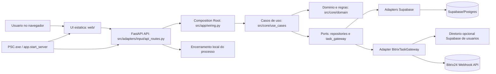
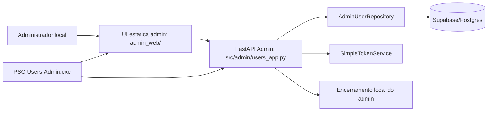
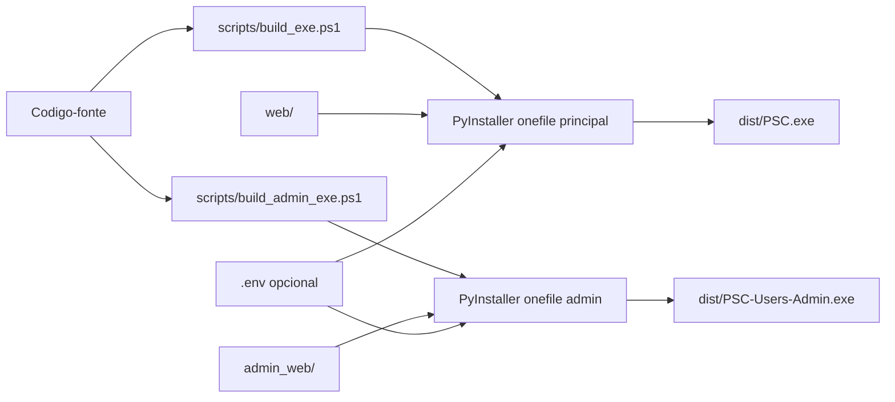

# Diagrama de Servicos: PSC Executavel

Data: 2026-07-11
Escopo: aplicacao executavel PSC e modulo executavel de administracao de usuarios. `psc-web/` esta fora do escopo.

## Executavel Principal

## Executavel Administrativo

## Fluxo de Build

## Responsabilidades por Servico/Modulo

| Modulo | Responsabilidade | Evidencia |
|---|---|---|
| `src/app/start_server.py` | Launcher CLI/executavel, limpeza de porta, abertura de navegador, startup Uvicorn e suporte a PyInstaller frozen. | `src/app/start_server.py` |
| `src/app/main.py` | Fabrica FastAPI, registra rotas, serve `web/` e expõe healthcheck. | `src/app/main.py` |
| `src/app/wiring.py` | Composition root do executavel principal; instancia settings, clients, repositories, gateways e use cases. | `src/app/wiring.py` |
| `src/adapters/input/api_routes.py` | Adapter HTTP: valida payloads, autentica bearer token e traduz erros de dominio em HTTP. | `src/adapters/input/api_routes.py` |
| `src/core/domain` | Modelos e regras puras de negocio. | `src/core/domain/models.py`, `src/core/domain/rules.py` |
| `src/core/use_cases` | Orquestracao de aplicacao para autenticacao, indicadores, areas, metas, projecoes, planos e issues. | `src/core/use_cases/` |
| `src/core/ports` | Contratos para repositories, sessao e gateway de tarefas. | `src/core/ports/repositories.py`, `src/core/ports/task_gateway.py` |
| `src/adapters/output/supabase_repositories.py` | Implementacao Supabase dos ports de persistencia e servico de token. | `src/adapters/output/supabase_repositories.py` |
| `src/adapters/output/bitrix_task_gateway.py` | Implementacao do gateway de tarefas/usuarios Bitrix. | `src/adapters/output/bitrix_task_gateway.py` |
| `src/infra` | Configuracao, clients Supabase e Bitrix, logging. | `src/infra/` |
| `web/` | UI do executavel principal. | `web/index.html`, `web/app.js`, `web/styles.css` |
| `src/admin/users_app.py` | App FastAPI separado para administracao local de usuarios. | `src/admin/users_app.py` |
| `admin_web/` | UI do executavel administrativo. | `admin_web/index.html`, `admin_web/app.js`, `admin_web/styles.css` |

## Dependencias Externas

| Dependencia | Uso | Fronteira |
|---|---|---|
| Supabase/Postgres | Persistencia de usuarios, areas, indicadores, valores, metas, projecoes, planos, Issue Reports e tags. | `infra/supabase_client.py`, `supabase_repositories.py`, `users_app.py` |
| Supabase opcional de usuarios | Diretorio para autocomplete de responsaveis Bitrix. | `SupabaseBitrixUserDirectory` |
| Bitrix24 webhook/API | Criacao de tarefas e busca de usuarios ativos. | `BitrixClient`, `BitrixTaskGateway` |
| Ferramentas de processo Windows | Limpeza de porta e encerramento local. | `start_server.py`, `users_app.py`, `api_routes.py` |

## Observacoes de Fronteira Arquitetural

- `core/` nao depende de FastAPI, Supabase, Bitrix, filesystem, navegador ou PyInstaller.
- Rotas HTTP e JavaScript estatico atuam como entrada/UI, nao como fonte principal de regra de negocio.
- `src/app/wiring.py` e a composition root do executavel principal.
- `src/admin/users_app.py` possui composicao propria por ser um executavel administrativo separado.
- `psc-web/` nao faz parte destes diagramas.
