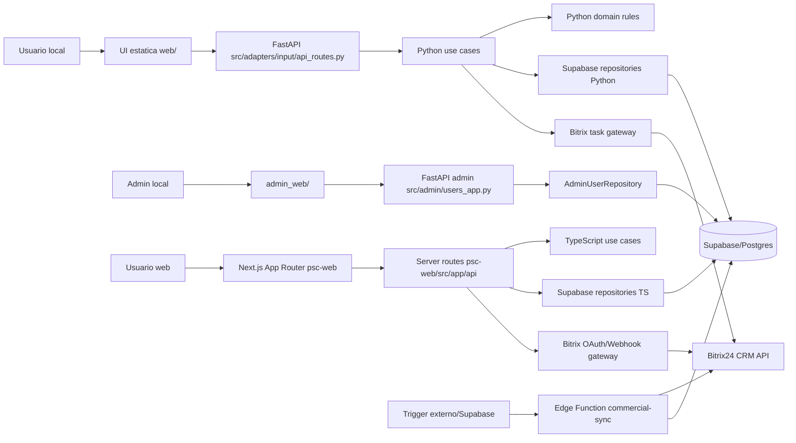
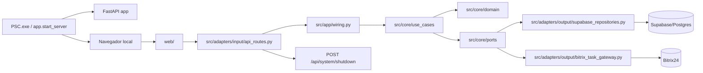
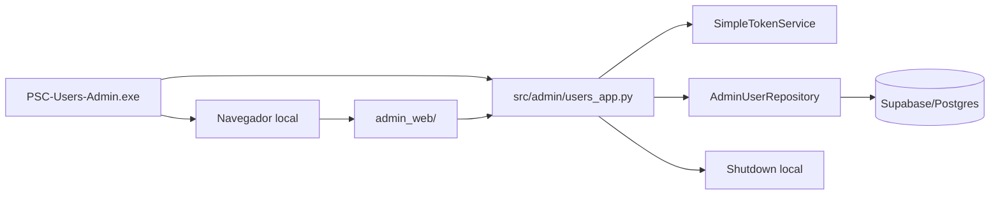
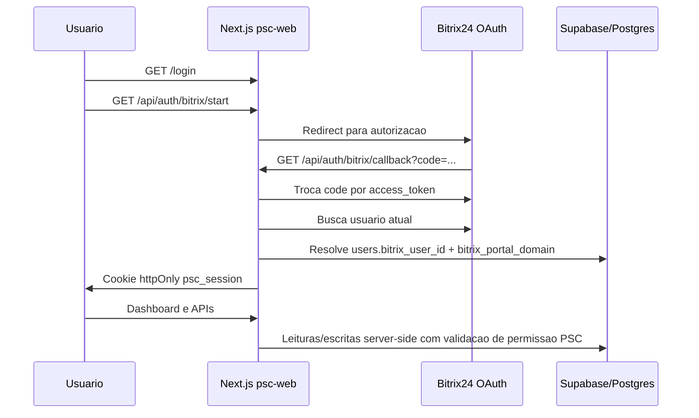
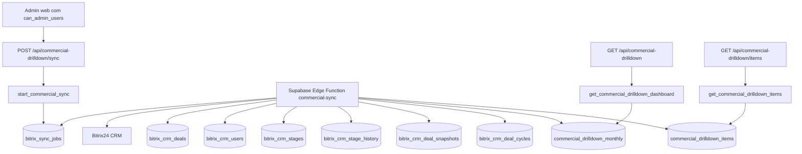
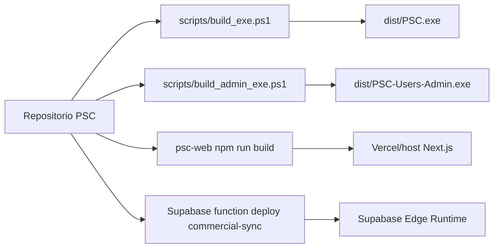

# Diagrama de Servicos: PSC

Data: 2026-07-31
Escopo: executavel local, admin local, fork web `psc-web/` e sincronizacao comercial.

## Visao Geral

## Executavel Principal

## Executavel Administrativo Local

## Fork Web Next.js

## Drill Down Comercial

## Build e Deploy

## Responsabilidades por Modulo

| Modulo | Responsabilidade | Evidencia |
|---|---|---|
| `src/app/start_server.py` | Launcher CLI/executavel, limpeza de porta, abertura de navegador e startup Uvicorn. | `src/app/start_server.py` |
| `src/app/main.py` | Fabrica FastAPI, registra rotas, serve `web/` e healthcheck. | `src/app/main.py` |
| `src/app/wiring.py` | Composition root Python. | `src/app/wiring.py` |
| `src/adapters/input/api_routes.py` | Adapter HTTP Python, auth bearer e traducao de erros. | `src/adapters/input/api_routes.py` |
| `src/core/` | Modelos, regras, ports e use cases Python. | `src/core/` |
| `src/adapters/output/` | Persistencia Supabase e gateway Bitrix na versao Python. | `src/adapters/output/` |
| `src/admin/users_app.py` | FastAPI separado para admin local. | `src/admin/users_app.py` |
| `web/` | UI estatica do executavel principal. | `web/index.html`, `web/app.js` |
| `admin_web/` | UI estatica do executavel admin. | `admin_web/index.html`, `admin_web/app.js` |
| `psc-web/src/app/` | Paginas e rotas Next.js App Router. | `psc-web/src/app/` |
| `psc-web/src/core/` | Dominio, regras, ports e use cases TypeScript. | `psc-web/src/core/` |
| `psc-web/src/adapters/output/` | Repositories Supabase e gateway Bitrix TypeScript. | `psc-web/src/adapters/output/` |
| `psc-web/src/infra/session.ts` | JWT de sessao e cookie HTTP-only. | `psc-web/src/infra/session.ts` |
| `supabase/functions/commercial-sync/` | Sincronizacao CRM Bitrix e reconstrucao de agregados comerciais. | `supabase/functions/commercial-sync/index.ts` |

## Dependencias Externas

| Dependencia | Uso | Fronteira |
|---|---|---|
| Supabase/Postgres | Persistencia operacional, RPCs comerciais, jobs e agregados. | Python repositories, TS repositories, SQL, Edge Function |
| Bitrix24 OAuth | Login web e identidade do usuario. | `psc-web/src/app/api/auth/bitrix/`, `BitrixGateway` |
| Bitrix24 Webhook/API | Busca de usuarios, tarefas de planos de acao e dados CRM para Drill Down. | Gateways Python/TS, Edge Function |
| Vercel/Next hosting | Host esperado para `psc-web`. | `psc-web/README.md`, `next.config.mjs` |
| PyInstaller/Windows | Empacotamento local one-file. | `scripts/`, `.spec` |

## Notas de Fronteira

- `core/` Python e `psc-web/src/core/` TypeScript concentram regras e contratos, mas nao sao automaticamente sincronizados; mudancas de regra devem ser duplicadas com cuidado.
- `psc-web` usa Supabase service role em rotas server-side; nao ha evidencia de acesso direto do browser ao Supabase.
- Drill Down Comercial foi desenhado para que clientes PSC leiam dados pre-calculados no Supabase e nao chamem Bitrix24 CRM diretamente.
- A Edge Function depende de segredos no ambiente Supabase: `SUPABASE_URL`, `SUPABASE_SERVICE_ROLE_KEY`, `BITRIX_WEBHOOK_URL` e variaveis comerciais opcionais.
