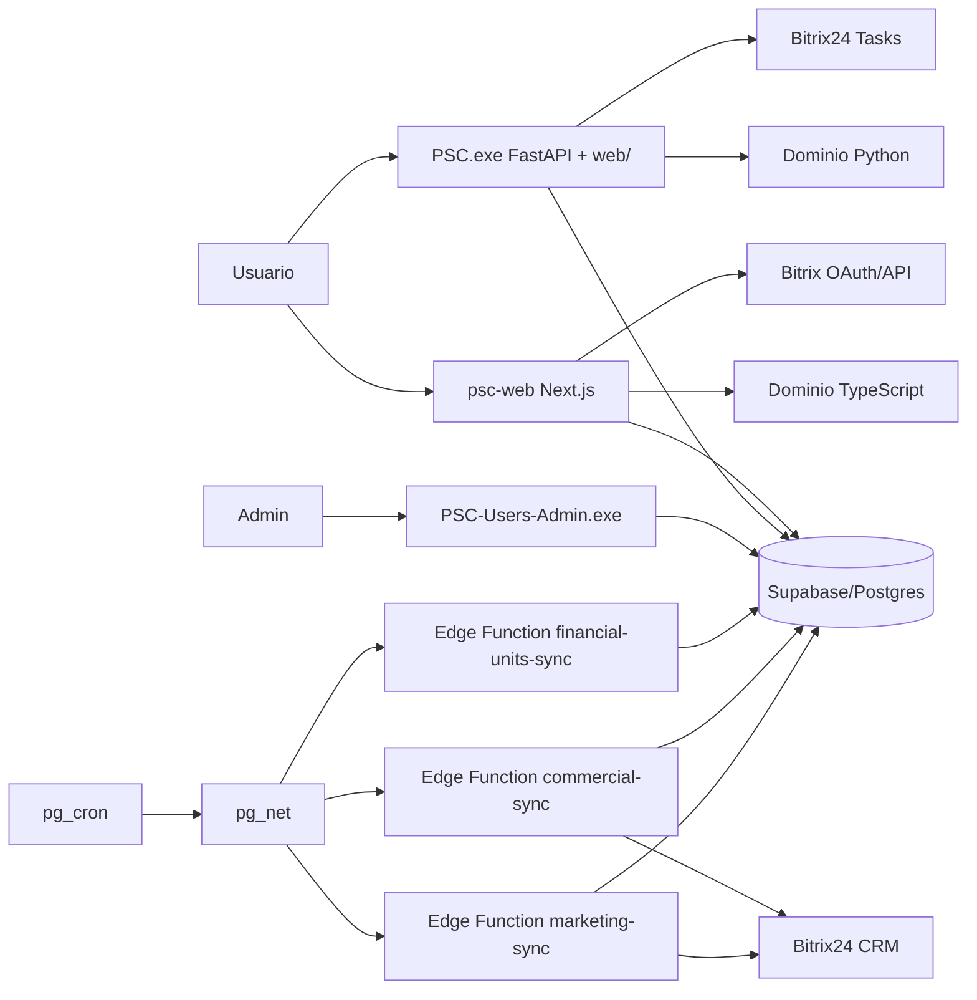
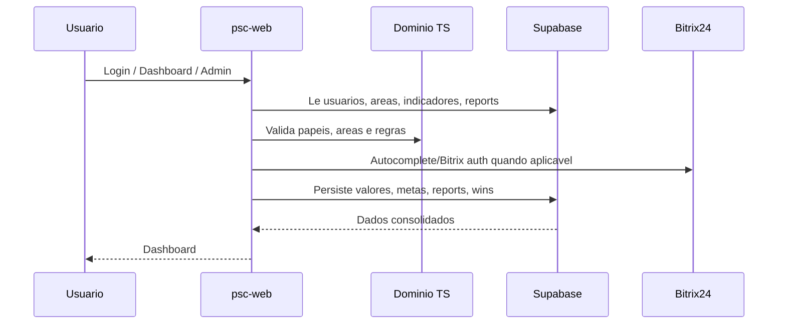
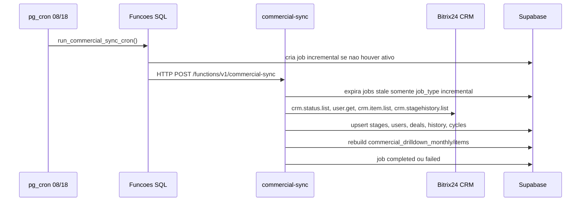
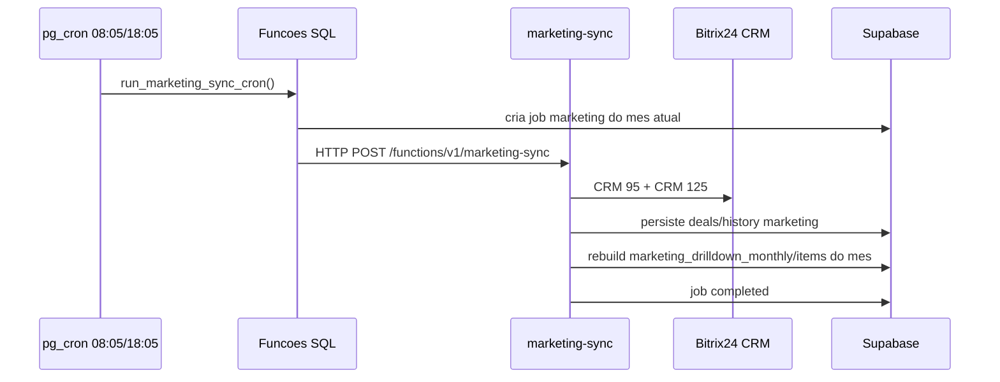

# Diagrama De Servicos: PSC

Data: 2026-08-04

## Visao Geral

```mermaid
flowchart LR
  User[Usuario] --> Web[psc-web Next.js]
  User --> Local[PSC.exe FastAPI + web/]
  Admin[Admin] --> AdminLocal[PSC-Users-Admin.exe]

  Web --> DomainTS[Dominio TypeScript]
  Web --> Supabase[(Supabase/Postgres)]
  Web --> BitrixAuth[Bitrix OAuth/API]

  Local --> DomainPY[Dominio Python]
  Local --> Supabase
  Local --> BitrixTasks[Bitrix24 Tasks]

  AdminLocal --> Supabase

  Cron[pg_cron] --> PgNet[pg_net]
  PgNet --> CommercialFn[Edge Function commercial-sync]
  PgNet --> MarketingFn[Edge Function marketing-sync]
  PgNet --> FinancialFn[Edge Function financial-units-sync]

  CommercialFn --> BitrixCRM[Bitrix24 CRM]
  MarketingFn --> BitrixCRM
  FinancialFn --> Supabase

  CommercialFn --> Supabase
  MarketingFn --> Supabase
```

## Fluxo Web Next.js

```mermaid
sequenceDiagram
  participant U as Usuario
  participant N as psc-web
  participant D as Dominio TS
  participant S as Supabase
  participant B as Bitrix24

  U->>N: Login / Dashboard / Admin
  N->>S: Le usuarios, areas, indicadores, reports
  N->>D: Valida papeis, areas e regras
  N->>B: Autocomplete/Bitrix auth quando aplicavel
  N->>S: Persiste valores, metas, reports, wins
  S-->>N: Dados consolidados
  N-->>U: Dashboard
```

## Fluxo De Sync Comercial

```mermaid
sequenceDiagram
  participant C as pg_cron 08/18
  participant SQL as Funcoes SQL
  participant E as commercial-sync
  participant B as Bitrix24 CRM
  participant S as Supabase

  C->>SQL: run_commercial_sync_cron()
  SQL->>S: cria job incremental se nao houver ativo
  SQL->>E: HTTP POST /functions/v1/commercial-sync
  E->>S: expira jobs stale somente job_type incremental
  E->>B: crm.status.list, user.get, crm.item.list, crm.stagehistory.list
  E->>S: upsert stages, users, deals, history, cycles
  E->>S: rebuild commercial_drilldown_monthly/items
  E->>S: job completed ou failed
```

## Fluxo De Sync Marketing

```mermaid
sequenceDiagram
  participant C as pg_cron 08:05/18:05
  participant SQL as Funcoes SQL
  participant E as marketing-sync
  participant B as Bitrix24 CRM
  participant S as Supabase

  C->>SQL: run_marketing_sync_cron()
  SQL->>S: cria job marketing do mes atual
  SQL->>E: HTTP POST /functions/v1/marketing-sync
  E->>B: CRM 95 + CRM 125
  E->>S: persiste deals/history marketing
  E->>S: rebuild marketing_drilldown_monthly/items do mes
  E->>S: job completed
```

## Responsabilidades

| Componente | Responsabilidade |
|---|---|
| `psc-web` | Interface web moderna, APIs server-side, dashboards e administracao. |
| `src/` Python | App legado/local, dominio core-first, adapters Supabase/Bitrix e executavel. |
| `supabase/functions/*` | Sincronizacoes fora da Vercel e materializacao de dados. |
| `sql/` | Schema, migrations, RPCs, views, helpers operacionais e crons. |
| Supabase | Banco, auth/tabelas, REST, Edge Functions, Vault, pg_cron/pg_net. |
| Bitrix24 | Origem de CRM, usuarios, tarefas e login/OAuth quando aplicavel. |

## Notas De Fronteira

- Clientes nao devem chamar Bitrix24 diretamente para Drill Downs; consultam dados pre-calculados no Supabase.
- Jobs de sync devem ser separados por `job_type`: `incremental`, `marketing`, `full` quando aplicavel.
- `CRM_import` foi tratado como legado instavel; caminho canonico recomendado e `commercial-sync`.
- `net._http_response` pode registrar timeout mesmo se o job continuar; a tabela `bitrix_sync_jobs` e fonte operacional mais confiavel para resultado da sync.
